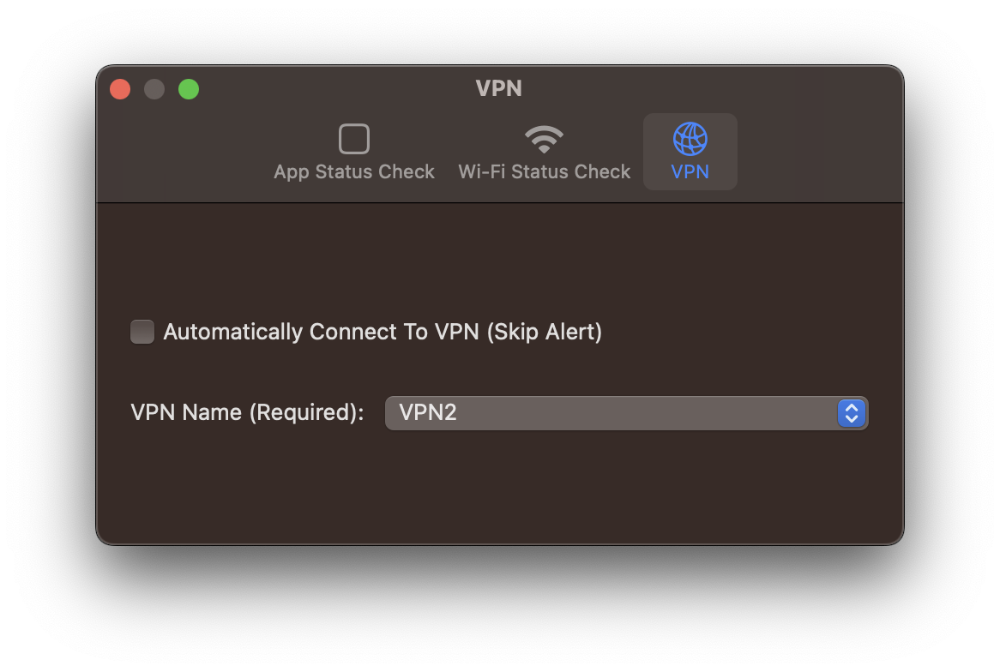
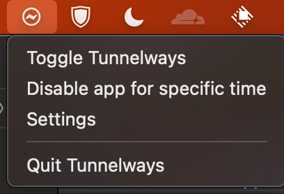
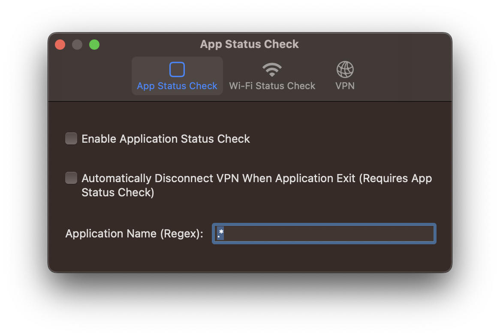
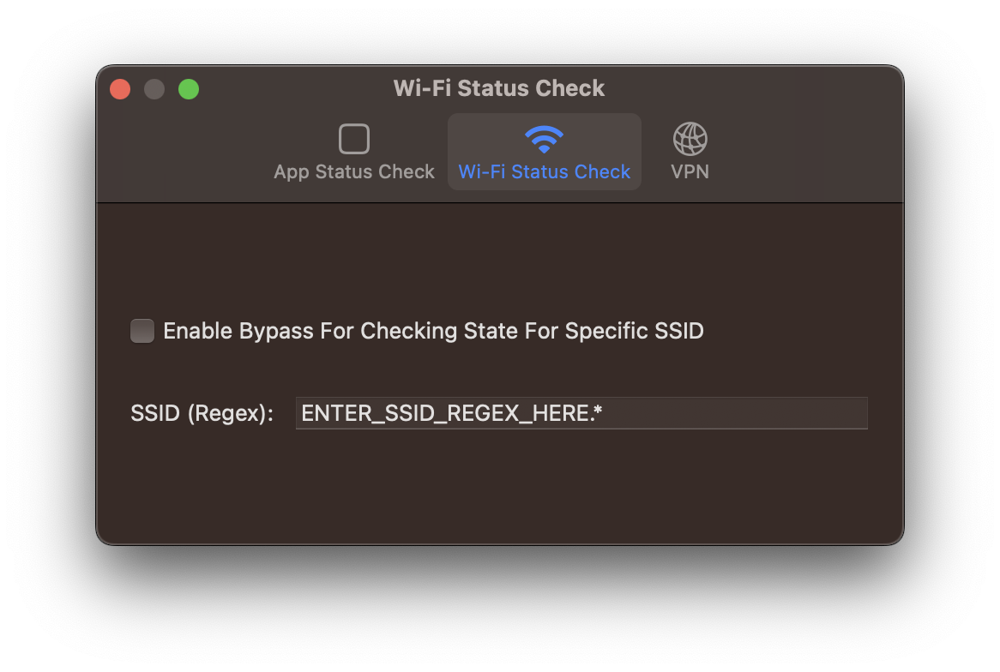

# Tunnelways

macOS app that automatically turns VPN on and off based on changes in app and network status

## Features

Show an alert based on

- App Status
  Check whether the specified apps are up (with Regex)
- Wi-Fi Status
  Check whether connected to the Wi-Fi with specified SSID (with Regex)

## Options

- Application Status Check
  - Automatically Disconnect VPN When Application Exits
- Wi-Fi Status Check
- VPN
  - Automatically Connect To VPN

## Gallery

## TODO

- [] Refactoring
- [] Add support for IPv6 (status check)
- [] Better UI
- [] Alerts shown twice
