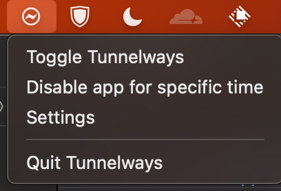
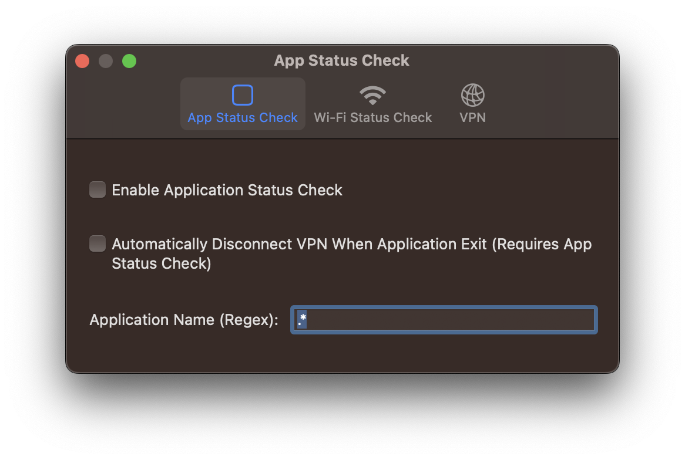

# Tunnelways

アプリやネットワークの状態の変化に応じてVPNを自動的にオン/オフするmacOSアプリ

## Features

以下の設定項目に当てはまる場合、VPN接続アラートを表示

- アプリのステータス
  指定したアプリが起動しているか確認（正規表現あり）
- Wi-Fiステータス
  指定したSSIDのWi-Fiに接続されているか確認（正規表現あり）

## Options

- アプリケーションの状態確認
  - アプリケーション終了時にVPNを自動切断
- Wi-Fiステータスチェック
- VPN
  - 自動的にVPNに接続

## Gallery

## TODO

- [] リファクタリング
- [] IPv6 のサポートを追加 (ステータスチェック)
- [] より良いUI
- [] アラートの二重表示を防止
- [] CI/CD
